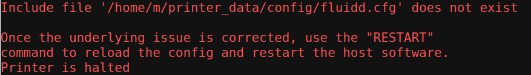
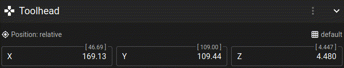
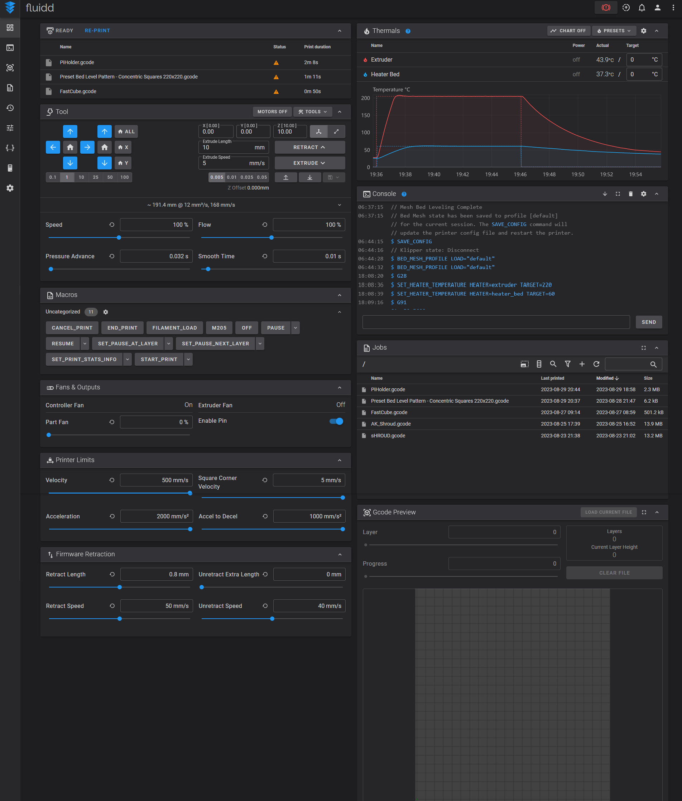

<link rel=”manifest” href=”docs/manifest.webmanifest”>

# Klipper (MOD)  

Can you run [Klipper](https://www.klipper3d.org/) on the stock mainboard of the Kobra 2 Neo?  
Oh yes, you can!  

The GigaDevice "GD32F303" being used on the stock mainboard is supported by the Klipper firmware.      
  
??? tip "Important Information To Be Aware Of" 

    - It should already be mentioned here that you can always go back to the stock firmware by just re-flashing it, so you might just want to give Klipper a try. 
    - Be aware of the fact that the control unit and display of the printer doesn't work after flashing Klipper due to the fact that the SPI the unit is connected to isn't supported by Klipper yet. See the belonging section further down below for more information. 
    - You'd need a host to run additional software like OctoPrint or Mainsail for being able to use the printer with Klipper. See the belonging section further down below for some information and my personal recommendation abput what to use.  
    If you don't have a host running OctoPrint/Mainsail/.. yet, see the chapter ["Printserver"](../printserver.md) for some information about hardware you could use for that.    
      

??? info "What Is Klipper?"

    Long story short: Klipper is an 'alternative' firmware which gives you way more possibilities and even functions for configuring and using your 3D printer. If you don't know what Klipper is, this may be a good start for your research: [All3DP: Klipper](https://www.all3dp.com/topic/klipper)  


---
  
## Requirements
If you want to use Klipper with your printer, you'll need additional hardware for having a host running Moonraker and Mainsail/Fluidd/Octoprint on, which then gets connected to the printer (which has to be flashed with the Klipper firmware of course). This doesn't has to be a RaspberryPi, pretty much every device you could run Linux on is suitable. Just use the [KIAUH](https://github.com/th33xitus/kiauh) script for an easy installation of the belonging software like Moonraker and e.g. Mainsail.   
**Please see the chapter ["Printserver"](../printserver.md) for some hardware I listed which you could use for that.**  

I'd like to mention that you don't necessarily need a host with a (touch) screen though, as the host is connected to your network and you'll access the UI of e.g. Mainsail through your browser (or by using an additional app on your smartphone or tablet, there are many ways to get in touch with your printer actually).  
So just to make it clear: let's assume you have an old laptop laying around with maybe a broken screen, or you only have a limited amount of space and no place to put your old laptop with a working screen - you could use both ones just fine. Just connect the device to a power outlet, to your network and to your printer, put it somewhere on a shelf or wherever it suits you and you're good.    
However, there are options to e.g. add a touchscreen to your host or use an old android device with e.g [Klipper Screen](https://klipperscreen.readthedocs.io/en/latest/) running and place it close to your printer, so that you have a control unit at the printer itself as well. But that absolutely isn't mandatory.  

---
  
## Installation

Basically you need to clone the Klipper repository and compile the necessary `klipper.bin` file (which you then rename to `firmware.bin` to actually flash the stock mainboard) which you flash onto the mainboard then. Please watch out for some dedicated tutorials about this procedure, as I don't offer a step by step guide here (yet) about it.  
For further information about the installation steps please read the chapter ["Installation"](https://www.klipper3d.org/Installation.html) of the official Klipper documentation.  

You can find the intial discussion about getting Klipper running on the Kobra 2 Neo [here in the Klipper discourse group](https://klipper.discourse.group/t/getting-orange-pi-3-lts-klipper-working-with-anycubic-kobra-2-neo/11278).  

**According to those posts**, to build the correct firmware, use the following configuration during the setup process for creating the `klipper.bin` file:  

- Micro-controller Architecture: STMicroelectronics STM32
- Processor model: STM32F103
- Bootloader: 36KiB  
- Communication interface: Serial on USART2 PA3/PA2 with 115200 baud rate   
  


!!! warning "Precompiled `klipper.bin` And `printer.cfg` Files Available!"  

    Thanks to [AJolly](https://github.com/AJolly) who contributed the specific files, you can now find them in the ["Kobra2Neo" folder of the "Klipper4Kobra2series" repository](https://github.com/1coderookie/Klipper4Kobra2series/tree/main/Kobra2Neo).   
    (*Note: please don't reach out to me if you have any questions about these files or the settings - neither am I the creator of these files nor do I own a K2Neo myself and therefore I can't test anything. Thanks.*)  


Once you've found or created the specific `klipper.bin` file, rename it to `firmware.bin` and copy it to the root directory (means, directly onto the card, not in a subfolder!) of your mSD card. I personally would suggest to remove all files from the mSD card and only copy the `firmware.bin` file onto it.  
Then you flash it as you would do with the stock firmware. Means, you turn off the printer, put the card into the cardreader and turn on the printer.  
Note that the screen doesn't update though after the flash procedure is done as the control unit doesn't work with Klipper anymore, it'll stick with the message "Firmware update. Please wait."! So just wait 5-10min to make sure everything had time enough to be installed.  
Then turn off the printer, remove the card, connect your host which has OctoPrint/Mainsail/.. running with the printer using an USB-C cable and turn on the printer again.  
Now you should be able to connect OctoPrint/Mainsail/.. with the printer. If an error message pops up that no connection to the MCU was possible, click on "Restart Firmware" or turn off the printer and switch it on again.  

!!! warning  
  
    - After flashing Klipper's `firmware.bin`, don't try to start printing right away!      
    - Proceed with the [configuration checks](https://www.klipper3d.org/Config_checks.html) before you're trying to print anything!      
    - Make sure to adjust the offset for the [z-endstop (command `Z_ENDSTOP_CALIBRATE`)](https://www.klipper3d.org/Manual_Level.html#calibrating-a-z-endstop) prior to printing!  


??? tip "Use KIAUH For Installation"

    If you're installing Klipper and frontends on [different hardware like a Raspberry Pi](../printserver.md#how-to-install) and therefore don't use e.g. the MainsailOS image for the RPi, you can use [KIAUH](https://github.com/th33xitus/kiauh), which is an installation script for Klipper, Moonraker, KlipperScreen, frontends like Mainsail and so on.  
    
??? tip "Installing Frontends As A Docker Container"

    If you want to install frontends like e.g. Mainsail as a Docker container, check out the [prind repository](https://github.com/mkuf/prind). 
    
---
  
## Configuration  
Besides the `klipper.bin` you also need a file named `printer.cfg` which contains the specific settings for your model. Please refer to the official Klipper documentation about [configuring Klipper](https://www.klipper3d.org/Installation.html#configuring-klipper).  

I won't mention and explain all the settings here as you can just use the official documentation of Klipper to see what each setting means.   

However, there is one thing I'd like to point out right now as it's causing trouble if one doesn't check on that: the lines `[include specific_filename_here.cfg]` in some of the example `printer.cfg` files that are available. I'll go into detail about that in the section ["[include additional.cfg]"](#include-additional-cfg), so please make sure to read that section as well.  
     
---    
    
## Special Functions   
In the following I'll list some of the special functions which make Klipper so interesting and outstanding compared to the stock firmware, besides the fact that you can adjust the firmware settings to your own needs.  

---
  
### G-Codes
Klipper uses **extended g-codes**.  
Therefore one has to be aware of the fact that not all of the 'regular' G-code commands are known and useable within Klipper.  
See the [g-codes chapter](https://www.klipper3d.org/G-Codes.html) of the official Klipper documentation for an overview of the specific commands.  

??? tip "Slicer Setting: G-Code Flavour"

    Look out for a setting in your slicer called something like "G-Code Flavour". If it's available, set the flavour to "Klipper".  
    In PrusaSlicer you can find this setting under "Printer Settings" -> "General" -> "Firmware" (you need to have "Expert" mode activated to get access to that option!). The following screenshot shows that setting.  
       

---

### Macros  
You can also use **macros** in Klipper.  
Basically a macro is a collection of g-code commands Klipper should execute.  
This macro is created and saved as an own file one calls in the `printer.cfg` then with the `[include]` command.  
You can set up your own macros to set up certain routines like when you want to change filament midprint or to e.g. use scripts to do automatic backups of your Klipper configs.   

Instead of creating one file for each macro and call it, you can also create only one file and put all of the macros in there - then you simply have to call that one specific file in the `printer.cfg`.  
As an example: you create a file called `gcode.cfg` where you list all the macros with the specific commands and then you simply add `[include gcode.cfg]` to your `printer.cfg`.  

*Please read the expandable textboxes below for some further explanations about the `[include additional.cfg]` command!*     

??? info "Include Additional.cfg"   

    You can include additional config files from the main printer config file as well by adding this command line to the start of the `printer.cfg` file: `[include additional.cfg]`, where "additional" will be replaced with the specific filename then.  
    In this "additional" config file you can list certain macros you created or you can list certain settings which will be loaded during the startup of Klipper.  
    By doing so, you not only keep your main `printer.cfg` short and easier to read, but you can also activate or deactivate loading certain settings for example by commenting or commenting out the specific "include" line.  
    Usually one does this for calling a macro from the start-gcode section of your slicer.  
    
    Attention though: you *need to have* that config file (which you referred to in that include line) existent though - if you don't have the file, Klipper won't start and reports an error message instead.   

    This might sound a bit confusing right now, so I'll try to clarify this with an example:    
    Imagine you want to use an additional Raspberry Pico with an ADXL345 sensor later for measuring resonances for Input Shaping. So you set up the hardware and then you create a file named `adxl345.cfg` for example. In this file you have all the settings for the set up hardware. In the main `printer.cfg` you add the line `#[include adxl345.cfg]` at the top.  
    Right now this file won't be loaded and executed, because you commented it with the hashtag right before the square bracket. So when you want to use the Pico with the sensor now and you plug it into the host Klipper is running on, you comment out the file by removing the hashtag, which "activates" the command and makes Klipper look out for this specific file to load during the start. Once you're done with the measuring and unplug the Pico again, you comment that line again by adding the hashtag, which 'deactivates' the command to look out for that specific file and load it.  
    If you *don't* do this and try to boot Klipper without the Pico being connected, Klipper won't start and reports an error message instead. Same goes for the case that you don't have that `adxl345.cfg` file existent and try to execute that include command.  

??? warning "Important Note On Include Files"

    The reason I'm going over this here is that in some `printer.cfg` files you can find there are certain `[include whatever.cfg]` lines already being listed. If you then try to use that printer config file but you don't have that specific files which should be included (or the hardware being referred to in that file isn't connected, like in the abovementioned example about the Pico), Klipper won't start and will report an error message instead.  
    
    The following screenshot shows an error report because of the missing file `fluidd.cfg` in the active line `[include fluidd.cfg]`.  
      
    To get rid of this error message, either 'deactivate' that line like this `#[include fluidd.cfg]` or create the belonging file `fluidd.cfg`.  
    
    So whenever you use a printer config file from someone else, check if any `[include whatever.cfg]` lines are existent. If so, either delete those lines, 'deactivate' them by adding a hashtag right before that square bracket like this: `#[include whatever.cfg]` or lookout for / create the belonging config file.  

You can then either run those macros by  

- typing in the belonging shell command (which would be the macro's name) in the Mainsail UI console terminal for having that macro executed,
- adding a button to the Mainsail UI which you can simply click on for having the macro executed or
- have a macro executed automatically by adding that command to your slicer's gcode (e.g. you want to have a macro for a purge line be executed automatically before a print starts - add that macro's name to the start g-code section).     

As I can't go into further details here, I'd highly recommend to read around about macros. To make the research easier for you, here are some links you can start with:  

- The description about [commands templates](https://www.klipper3d.org/Command_Templates.html) in the official documentation.
- **The article ["Klipper: Macros - Simply Explained"](https://all3dp.com/2/klipper-macros-simply-explained/) at all3dp.com which gives a nice and short overview about how macros work.**
- **The detailed article ["Klipper Macros - What They Are and How to Use Them"](https://www.obico.io/blog/klipper-macros/#what-are-klipper-macros) at the Obicio blog.**
- The article ["Voidtrance Klipper Macros Beginners Guide](https://docs.vorondesign.com/community/howto/voidtrance/Klipper_Macros_Beginners_Guide.html) of the Voron Design community.
- The ["Macro Creation Tutorial"](https://klipper.discourse.group/t/macro-creation-tutorial/30) at Klipper's discourse group.
- The [collection of Klipper macros](https://github.com/jschuh/klipper-macros) by [Justin Schuh](https://github.com/jschuh). 


---
 
### Include Additional.cfg 
You can include additional config files from the main printer config file as well by adding this command line to the start of the `printer.cfg` file: `[include additional.cfg]`, where "additional" will be replaced with the specific filename then. In this "additional" config file you can list certain macros you created or you can list certain settings which will be loaded during the startup of Klipper.  
By doing so, you not only keep your main `printer.cfg` short and easier to read, but you can also activate or deactivate loading certain settings for example by commenting or commenting out the specific "include" line.  
You *need to have* that config file (which you referred to in that include line) existent though - if you don't have the file, Klipper won't start and reports an error message instead.   

This might sound a bit confusing right now, so I'll try to clarify this with an example:    
Imagine you want to use an additional Raspberry Pico with an ADXL345 sensor later for measuring resonances for Input Shaping. So you set up the hardware and then you create a file named `adxl345.cfg` for example. In this file you have all the settings for the set up hardware. In the main `printer.cfg` you add the line `#[include adxl345.cfg]` at the top.  
Right now this file won't be loaded and executed, because you commented it with the hashtag right before the square bracket. So when you want to use the Pico with the sensor now and you plug it into the host Klipper is running on, you comment out the file by removing the hashtag, which "activates" the command and makes Klipper look out for this specific file to load during the start. Once you're done with the measuring and unplug the Pico again, you comment that line again by adding the hashtag, which 'deactivates' the command to look out for that specific file and load it.  
If you *don't* do this and try to boot Klipper without the Pico being connected, Klipper won't start and reports an error message instead. Same goes for the case that you don't have that `adxl345.cfg` file existent and try to execute that include command.  

!!! warning "Important Note On Include Files"

    The reason I'm going over this here is that in some `printer.cfg` files you can find there are certain `[include whatever.cfg]` lines already being listed. If you then try to use that printer config file but you don't have that specific files which should be included (or the hardware being referred to in that file isn't connected, like in the abovementioned example about the Pico), Klipper won't start and will report an error message instead.  
    
    The following screenshot shows an error report because of the missing file `fluidd.cfg` in the active line `[include fluidd.cfg]`.  
      
    To get rid of this error message, either 'deactivate' that line like this `#[include fluidd.cfg]` or create the belonging file `fluidd.cfg`.  
    
    So whenever you use a printer config file from someone else, check if any `[include whatever.cfg]` lines are existent. If so, either delete those lines, 'deactivate' them by adding a hashtag right before that square bracket like this: `#[include whatever.cfg]` or lookout for / create the belonging config file.  

---

### Z-Offset

Before starting a printjob the very first time after installing Klipper, you need to set the probe's z-offset (distance of the probe to the PEI plate).  
As the Kobra 2 Neo doesn't have a physical limit switch for the Z axis but uses the probe as a virtual endstop instead, this is crucial.  

For doing so, you have to execute the following command while you're proceeding the [configuration checks](https://www.klipper3d.org/Config_checks.html): [`PROBE_CALIBRATE` for setting the z-offset of the probe](https://www.klipper3d.org/Probe_Calibrate.html#calibrating-probe-z-offset).

Please click on the link and read the official documentation about this commands and how to proceed.  

*Once done with adjusting the height, click on "ACCEPT" - and just to be on the safe side, send a `SAVE_CONFIG` command as well.* 


!!! warning "Wait For The Printhead Being Moved"

    When executing the abovementioned command, you need to move the *probe* to the center of the bed by typing in the specific X and Y coordinates.  
    Once done with that, you then type in the belonging command for starting the actual calibration process. The head will move down a bit until the probe detects the PEI plate.  
    Once the surface has been detected, a little window will pop up (referring to the Mainsail UI here) which allows you to change the Z position.  
    **BUT - and this is CRUCIAL! - the head will start to slowly move sidewards in this moment to position the nozzle right above the point where the probe has been located!** ***You need to WAIT for this movement to be done!*** **So inspect the head and wait until it doesn't move anymore before adjusting the actual height!**
    


  
---
  
### ABL, Bed Mesh, Manual Bed Leveling 

Of course Klipper supports both ABL and manual bed leveling as well. Please see the official Klipper documentation for more detailed information about this topic, I'll only mention some notes about it here in the following. So before you continue to read here, maybe check out the official Klipper documentation first and read the chapters ["Bed Level Support"](https://www.klipper3d.org/Config_Reference.html#bed-level-support) and ["Bed Level"](https://www.klipper3d.org/Bed_Level.html).  

After executing an ABL sequence, you need to save those results for having them written to your `printer.cfg` file - they *won't* be saved automatically!  
You can either choose an individual name or just save it as "default".  

However, for loading the values and to get ABL to work while printing, you need to add a specific command to your `[gcode_macro START_PRINT]` file to load the bed mesh profile. This command `BED_MESH_PROFILE LOAD=...` has to be added *after* the last G28 (home the printer) command in there, with the belonging name of the mesh that should be loaded.  
Here's an example of how it looks like with the belonging command for a bed mesh saved as "default".  

```
# Home the printer 
G28

# Load default bed mesh profile
BED_MESH_PROFILE LOAD=default
```

If you chose individual names for different bed meshs (e.g. "mesh1"), you need to name the specific one you want to be loaded then in the abovementioned command (e.g. `BED_MESH_PROFILE LOAD=mesh1`).  
If you saved the mesh using the "default" name like it's being suggested by the UI, enter the name "default" as shown above.    

You can create different bedmeshs for e.g. different bed temperatures by using different names and load them automagically using e.g. the belonging name of the filament type being set in the Slicer. Means, you set the filament type in your Slicer and add a certain entry in the start g-code section of the Slicer, so that the filament type will be written into the generated g-code file. In addition to that you then write a macro for Klipper which then loads the belonging bedmesh for the type of filament being used, like the bedmesh you did at 60°C bed temperature for printing PLA or the one you did at 80°C for printing PETG.    

You can configure the ABL procedure within your `printer.cfg` as well so that it fits your needs.  
Means, you can change the amount and location of probing points, the probing speed and the amount of probes for each probing point. You can also choose between different probe algorithms. 

As an example, this is the belonging section `[bed_mesh]` in the `printer.cfg` file (the actual settings might differ - this is just an example!):  
```
[bed_mesh]
speed: 400
horizontal_move_z: 7
mesh_min: 32, 26
mesh_max: 189, 189
probe_count: 5, 5
relative_reference_index: 13
algorithm: lagrange
```  
Please see the [configuration reference for the bed mesh](https://www.klipper3d.org/Config_Reference.html#bed_mesh) for more detailed information.  

When you did everything correct, you can observe the ABL compensation working, as you can see in the following screencast of the Mainsail UI. Look at the changing value in those square brackets of the Z axis, right above the "Z 4.480" value.  
  

??? tip "Probe Count And Mesh Min/Max"  

    As we have an inductive proximity sensor which has some sort of 'wide' probe surface and not a pointy one like a BL-Touch probe for example, it's advisable to not probe too close to the bed's borders and to not use too many probe counts, so that the probing will be reliable.   

There are also solutions to do a bedmesh before every print which probe the specific area you're going to print on. So instead of probing the whole bedplate, only the belonging area will be probed:   

- [Klipper Adaptive Meshing & Purging](https://github.com/kyleisah/Klipper-Adaptive-Meshing-Purging) 
- [Klipper mesh on print area only install guide](https://gist.github.com/ChipCE/95fdbd3c2f3a064397f9610f915f7d02)

  
Besides that, you can also use manual bed leveling in addition to the ABL, see the belonging description in the official Klipper documentation [here](https://www.klipper3d.org/Manual_Level.html).  
This is especially useful for people who replaced the stock spacers of the bed with [adjustable spacers](../hardware/bed/#different-spacers) for being able to tram the bed itself as well.  

I'd suppose to also read the description of the function ["screws_tilt_adjust" with the command "SCREWS_TILT_CALCULATE"](https://www.klipper3d.org/Manual_Level.html#adjusting-bed-leveling-screws-using-the-bed-probe), which tells you exactly how much and in which direction you have to turn each screw to tram the bed (after configuring it for your printer) by using the probe.  

---
  
### Pressure Advance
By using Klipper you can take advantage of using a feature called "Pressure Advance".    
Basically this function looks ahead while printing and adjusts the pressure of the filament, so that the typical over- and underextrusion at the beginning and end of a layer you often experience will be avoided.  

This feature (called "Linear Advance" at Marlin firmware) can't be successfully used with the current stock firmware and the TMC2208 stepper drivers, so this is actually a huge plus for Klipper.  

Please refer to the official Klipper documentation of [Pressure Advance](https://www.klipper3d.org/Pressure_Advance.html) about how to calibrate and use it.  

---

### Resonance Compensation: Input Shaping
By using Klipper you can take advantage of using Resonance Compensation and a feature called "Input Shaping".  
This function compensates certain resonances (after provoking them while measuring the x and y axis), which avoids artefacts of the printed model called 'ringing' and 'ghosting'. This is especially useful when printing at higher speeds.  
You can calibrate it manually or by using additional hardware like ADXL345 acceleration sensors (recommended).  

Please refer to the official Klipper documentation of [Resonance Compensation](https://www.klipper3d.org/Resonance_Compensation.html#resonance-compensation) about how to calibrate and use it.

---
  
## Stock Control Unit
The stock control unit *doesn't* work with Klipper, means, you can't use it for *controlling* the printer.  
This might sound intimidating in the first place, but it really isn't.  
You can control the whole machine via the UI of your frontend (e.g. Mainsail, Fluidd).    
However, if you really do miss the option to *control the printer* right at that place later, you have several options to do so:  

- You can use your smartphone, tablet or laptop to just open the mainsail.local page at your browser and use the regular Mainsail frontend (which might be a bit 'uncomfortable' when using a smartphone though).  
- You can use an old smartphone or tablet and install [KlipperScreen](https://klipperscreen.readthedocs.io/en/latest/) onto it, which then gives you a nice adapted UI with control buttons.   
  I also set it up at one of my Kobra (1) Neos, printed a holder for it and mounted it where the original control unit was as shown in the picture below. <br>  <br> Actually I unplugged the phone again as I just control the printer via my computer and the mainsail.local page anyway though. It also kinda bothers me that I have to boot up the phone all the time as I don't leave the printer on 24/7, so I'll probably go with the next solution I'll mention.   
- If you have a Raspberry Pi or other hardware you could connect a touchscreen to (e.g. by using a HMDI port) running for hosting Mainsail, you can add a touchscreen to that and use [KlipperScreen](https://klipperscreen.readthedocs.io/en/latest/). It's the same UI like using a smartphone or tablet.   
  This is actually a quite handy solution if you're using a RPi as you can set everything up in a dedicated case. I'll probably do that as well, just for the pure comfort of not having to take care about switching the smartphone on and off as the display is powered by the RPi. I just didn't want to spend money again when trying Klipper initially, that's why I used an old smartphone in first place.    

<!--
*There is another use case for the stock control unit though: @[jokubasver](https://github.com/jokubasver) managed to use the stock control unit as a screen!*  
You need to wire it up to your RPi and have KlipperScreen running. As the stock control unit isn't a touchscreen and the knob isn't supported in KlipperScreen for operating/controlling Klipper, the unit only acts as a pure display, but at least you'll be able to use it and have the advantage of having certain status information present. The following picture shows this solution.  

  

You can find his solution in the following GitHub repository: [https://github.com/jokubasver/Anycubic-Kobra-Go-Neo-LCD-Driver](https://github.com/jokubasver/Anycubic-Kobra-Go-Neo-LCD-Driver)  
-->  

---
       
## OctoPrint, Mainsail or Fluidd?
To find out what's the best solution for you, either do a little research on that, watch some YouTube videos or just get another mSD card for your RPi, install e.g. MainsailOS onto it and then just give it a try.  
Due to the fact that I personally use and recommend Mainsail, I'll always refer to it when it comes down to describe or show certain things in this chapter.  

---

### OctoPrint
OctoPrint is mentioned and referred to at the Klipper page, so you can use it just fine.  
You'd need to SSH to the host (e.g. the RPi) to upload edited files like the `printer.cfg` though - if there isn't a plugin for that which allows you to do so within the interface of OctoPrint (I don't know actually).  

---
  
### Mainsail
I personally prefer to use Mainsail with Klipper as it's tailored for Klipper and gives you more tools made for Klipper right away.  
Just to mention a few here: 

- You can edit the `printer.cfg` and every other file just directly within Mainsail and don't have to SSH to the Raspberry Pi.   
- You already have a heightmap function included which allows you to create and display the meshview after executing an ABL.   
- If your slicer does support it (SuperSlicer does), you can have thumbnails of your models displayed.   
- There's also a G-Code viewer already built in.   
- You have the possibilty to create custom macros and add scripts for e.g. executing backups and activate them with one click.   
- And much more..   

Please see the [official documentation site](https://docs.mainsail.xyz/) for further information.  

(add screenshot)

---
  
### Fluidd
Fluidd is kinda similar to Mainsail, so it's a great alternative if you don't want to use Mainsail. Please see the [official documentation site](https://docs.fluidd.xyz/) for further information.  

The following screenshot shows the dashboard overview of Fluidd (without a camera for monitoring the printer being used).  


-->    

---

[](https://ko-fi.com/U6U5NPB51)  

