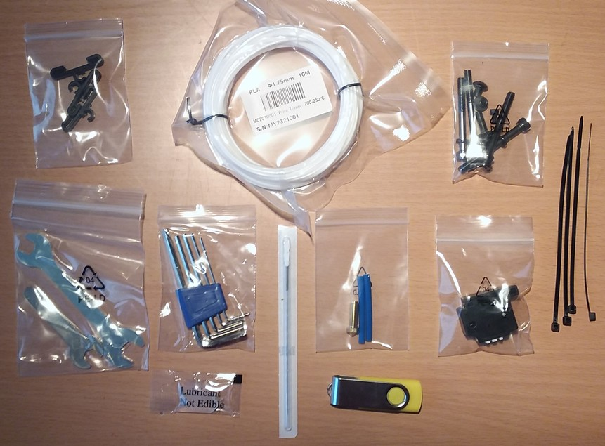

<link rel=”manifest” href=”docs/manifest.webmanifest”>

# Printer
The Anycubic [Kobra 2 Neo](https://www.anycubic.com/products/kobra-2-neo) is an entry-level bedslinger FDM printer which is advertised as being capable to print at 150mm/s speed (up to 250mm/s max).  
  
The Kobra 2 Neo comes partially pre-assembled, you only have to mount a few parts like the 'upstanding' z-axis frame onto the base frame.  
  
See [Anycubic's support page](https://www.anycubic.com/pages/firmware-software) to find manuals, test files and the suggested parameters profiles for this machine.    

The following pictures show the machine.  
  
| Kobra 2 Neo frontview | Kobra 2 Neo backview |  
|:---------------------:|:--------------------:| 
|  |   |  

*Note: I didn't attach the filament spool holder to the left side of the machine as it should be done when taking these pictures for being able to put both pictures between each other in a decent size here.*   

---

## Specifications  
  
The following list gives an overview of the most important specifications:    
  
- Printing dimension: 250 x 220 x 220 mm (HxWxD)  
- Printing platform: 8.7 x 8.7inches / 220 x 220mm (*Attention: the physical dimensions of the bed and the PEI plate are 230x230mm!*)  
- Machine dimensions: 485 x 440 x 440mm (HxWxD) (plus filament holder mounted to the side)   
- Machine weight: approx. 7.3 kg  
- Aluminum frame  
- X-axis and Y-axis: belt driven, belt tension can be adjusted by knobs  
- Z-axis: single threaded rod  
- Printing speed: ≤100 mm/s (Max speed)  
- Control panel: 2.4" LCD screen with a control knob  
- Mainboard: TriGorilla V_4.0.1, 32bit, 24V, TMC2208(?) silent stepper drivers (soldered), microSD card reader, USB-C connector 
- Extruder / feeder system: Direct drive, single geared  
- Heated aluminum bed with a magnetic foil glued onto it, comes with a removable PEI-coated spring steel plate (one-sided textured); *physical dimensions: 230x230mm*  
- Hot bed temperature: ≤ 230 °F / 110 °C  
- Bed leveling: "Anycubic LeviQ 2.0", which is a 25-point bed level measuring process 
- Power supply: 400W, 24V DC output, suitable for 110V/230V AC input (set the correct voltage with a switch before using it!)
- Printing material: PLA / ABS / PETG & TPU (optional housing recommended for certain material)  
- Single nozzle in a **proprietary Volcano-like** type hotend, filament diameter 1.75 mm  
- Comes with a proprietary Volcano-like 0.4 mm brass nozzle which is replaceable  
- Nozzle temperature: ≤ 500 °F / 260 °C  
- Optional filament run-out detection sensor  

 ---

## Box Content

The printer comes partially preassembled and well packed in one big box.  

  
  
Along with the printer come some additional parts, like a sample of PLA, a microSD card reader, some tools, a spare nozzle and so on. You can see these items in the following picture.  

   

---

  
 
